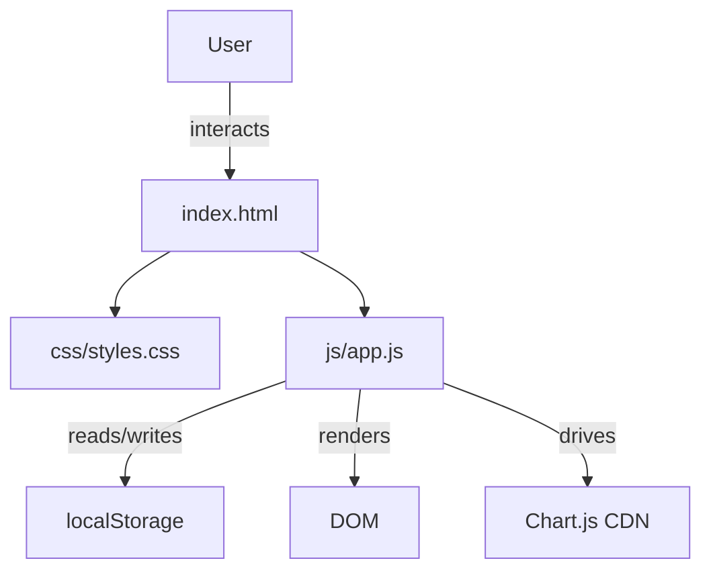
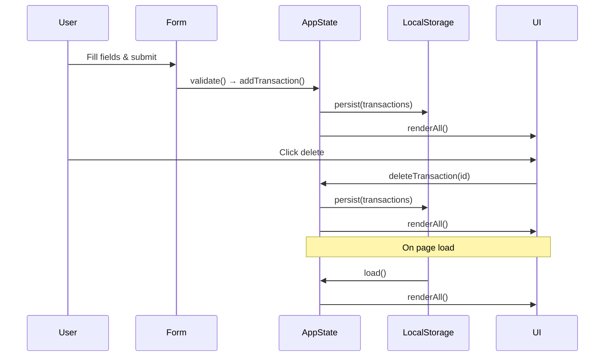

# Design Document: Expense & Budget Visualizer

## Overview

The Expense & Budget Visualizer is a fully client-side web application delivered as three static files: `index.html`, `css/styles.css`, and `js/app.js`. There is no build step, no framework, and no backend. Chart.js is loaded via CDN for pie chart rendering. All data is persisted in the browser's `localStorage` under a single key.

The UI is organized top-to-bottom:
1. Total balance header
2. Input form (name, amount, category)
3. Scrollable transaction list
4. Pie chart

State is held in a single in-memory array of transaction objects. Every mutation (add / delete) updates the array, re-renders the affected UI regions, and writes the serialized array back to `localStorage`.

---

## Architecture



All logic lives in `js/app.js`. There is no module bundler; the script is loaded as a plain `<script>` tag at the bottom of `<body>`. Chart.js is loaded before `app.js` via a CDN `<script>` tag.

### Data Flow



---

## Components and Interfaces

### `app.js` — Module Structure

The script is organized into clearly separated concerns using plain functions and a single shared state object.

```
State
  transactions: Transaction[]

Persistence
  loadFromStorage() → Transaction[]
  saveToStorage(transactions: Transaction[]) → void

Validation
  validateForm(name, amount, category) → ValidationResult

State Mutations
  addTransaction(name, amount, category) → void
  deleteTransaction(id) → void

Rendering
  renderBalance() → void
  renderList() → void
  renderChart() → void
  renderAll() → void

Event Wiring
  init() → void   ← called on DOMContentLoaded
```

### HTML Structure (`index.html`)

```html
<body>
  <header>
    <h1>Expense Tracker</h1>
    <div id="balance">Total: $0.00</div>
  </header>

  <main>
    <section id="form-section">
      <form id="transaction-form">
        <input id="item-name" type="text" placeholder="Item name" />
        <input id="item-amount" type="number" min="0.01" step="0.01" placeholder="Amount" />
        <select id="item-category">
          <option value="">Select category</option>
          <option value="Food">Food</option>
          <option value="Transport">Transport</option>
          <option value="Fun">Fun</option>
        </select>
        <button type="submit">Add</button>
        <div id="form-error" aria-live="polite"></div>
      </form>
    </section>

    <section id="list-section">
      <ul id="transaction-list"></ul>
    </section>

    <section id="chart-section">
      <canvas id="expense-chart"></canvas>
    </section>
  </main>
</body>
```

### CSS Layout (`css/styles.css`)

- CSS custom properties for the color palette (one accent color per category)
- Flexbox column layout for `<main>`
- `#transaction-list` has `max-height` + `overflow-y: auto` for scrollability
- Minimal, clean aesthetic: neutral background, card-style sections with subtle box-shadow, clear typographic hierarchy

---

## Data Models

### Transaction

```js
{
  id: string,        // crypto.randomUUID() or Date.now().toString()
  name: string,      // non-empty, trimmed
  amount: number,    // positive float, rounded to 2 decimal places
  category: "Food" | "Transport" | "Fun"
}
```

### ValidationResult

```js
{
  valid: boolean,
  errors: string[]   // human-readable messages, one per invalid field
}
```

### LocalStorage Schema

- Key: `"expense-tracker-transactions"`
- Value: `JSON.stringify(Transaction[])`
- On parse failure or missing key: fall back to `[]`

### Category Color Map

```js
const CATEGORY_COLORS = {
  Food:      "#FF6384",
  Transport: "#36A2EB",
  Fun:       "#FFCE56"
};
```

---

## Correctness Properties

*A property is a characteristic or behavior that should hold true across all valid executions of a system — essentially, a formal statement about what the system should do. Properties serve as the bridge between human-readable specifications and machine-verifiable correctness guarantees.*

### Property 1: Valid transaction submission adds to list and LocalStorage

*For any* valid transaction (non-empty name, positive amount, valid category), submitting the form SHALL result in the transaction appearing in the rendered transaction list and in the deserialized contents of `localStorage`.

**Validates: Requirements 1.2, 5.1**

---

### Property 2: Invalid inputs are rejected with error and list is unchanged

*For any* form submission where at least one field is empty, the amount is non-positive, or no category is selected, the validator SHALL reject the submission, display at least one inline error message, and leave the transaction list length unchanged.

**Validates: Requirements 1.3, 1.4**

---

### Property 3: Form resets after successful submission

*For any* valid transaction submission, all form fields (name, amount, category) SHALL be reset to their default empty/unselected state after the transaction is added.

**Validates: Requirements 1.5**

---

### Property 4: Transaction list renders all transactions with correct data

*For any* array of transactions written to `localStorage`, initializing or re-rendering the app SHALL produce a transaction list where every transaction's name, amount, and category are visibly present in the DOM.

**Validates: Requirements 2.1, 2.2**

---

### Property 5: Delete removes transaction from list and LocalStorage

*For any* transaction currently in the list, clicking its delete control SHALL remove it from the rendered list and from the deserialized `localStorage` contents, while all other transactions remain unchanged.

**Validates: Requirements 2.4, 5.2**

---

### Property 6: Balance equals sum of all transaction amounts

*For any* set of transactions (including the empty set), the displayed balance SHALL equal the arithmetic sum of all transaction amounts, rounded to two decimal places. This property holds after every add and delete operation.

**Validates: Requirements 3.1, 3.2, 3.3, 3.4**

---

### Property 7: Chart segments reflect active categories

*For any* set of transactions, the chart dataset SHALL contain exactly one data entry per category that has at least one transaction, and each entry's value SHALL equal the sum of amounts for that category.

**Validates: Requirements 4.1, 4.2**

---

### Property 8: LocalStorage serialization round-trip

*For any* array of transaction objects, serializing it to `localStorage` and then deserializing it SHALL produce an array that is deeply equal to the original (same ids, names, amounts, and categories, in the same order).

**Validates: Requirements 5.1, 5.2, 5.3**

---

## Error Handling

| Scenario | Behavior |
|---|---|
| `localStorage` unavailable (e.g., private browsing quota exceeded) | Catch the `SecurityError` / `QuotaExceededError` in `saveToStorage`; app continues in-memory without persistence |
| `localStorage` contains malformed JSON | `JSON.parse` wrapped in try/catch; fall back to `[]` |
| `localStorage` contains structurally invalid data (missing fields) | Filter out malformed entries during load; proceed with valid subset |
| Chart.js CDN fails to load | `window.Chart` will be undefined; `renderChart` guards with `if (!window.Chart)` and shows a fallback text message |
| Form submitted with invalid data | Inline error messages shown in `#form-error`; no state mutation occurs |
| `crypto.randomUUID` unavailable (very old browsers) | Fall back to `Date.now() + Math.random()` for id generation |

---

## Testing Strategy

### Unit Tests (example-based)

Focus on specific behaviors and edge cases:

- `validateForm` returns errors for each invalid field combination
- `validateForm` accepts valid inputs
- `loadFromStorage` returns `[]` for missing key, malformed JSON, and structurally invalid data
- `saveToStorage` writes correct JSON string to `localStorage`
- Balance calculation returns `0` for empty list
- Balance calculation returns correct sum for known inputs
- Chart data builder returns correct segments for a known transaction set
- Chart data builder returns empty dataset for no transactions

### Property-Based Tests

Use a property-based testing library (e.g., [fast-check](https://github.com/dubzzz/fast-check) for JavaScript) with a minimum of **100 iterations per property**.

Each test is tagged with:
`// Feature: expense-budget-visualizer, Property N: <property text>`

| Property | Generator | Assertion |
|---|---|---|
| P1: Valid submission adds to list and storage | Random `{name, amount, category}` tuples | Transaction in list + localStorage |
| P2: Invalid inputs rejected | Random invalid field combinations | Error shown, list length unchanged |
| P3: Form resets after submission | Random valid transactions | All fields empty/default after add |
| P4: List renders all transactions | Random `Transaction[]` arrays | Every item's data present in DOM |
| P5: Delete removes from list and storage | Random list + random index to delete | Item gone, others unchanged |
| P6: Balance equals sum | Random `Transaction[]` with known amounts | `displayedBalance === sum(amounts)` |
| P7: Chart segments match active categories | Random `Transaction[]` | Chart entries match active categories and sums |
| P8: Serialization round-trip | Random `Transaction[]` | `deserialize(serialize(arr))` deep-equals `arr` |

### Integration / Smoke Tests

- Verify `index.html`, `css/styles.css`, and `js/app.js` exist at the correct paths
- Verify Chart.js `<script>` tag points to a CDN URL
- Manual cross-browser smoke test in Chrome, Firefox, Edge, Safari
